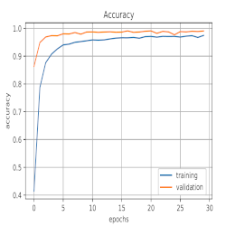
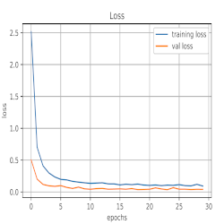

# Traffic-sign-detection-in-real-time

This code is part of bachelor´s thesis, focused on Traffic signs detection. The thesis is avaiable [here](https://www.vutbr.cz/studenti/zav-prace/detail/128219).

**This repository contains 2 main parts: Classifier and Detector**

The requirements of python packages for any part are listed in this [file](requirements.txt)

## Classifier

The classifier was trained for 42 classes on [GTSRB](https://benchmark.ini.rub.de/gtsrb_news.html) dataset. Which is provided by Institut for neuroinformatic.

**Main scripts for classifier are:** 

[classifier_train.py](classifier_train.py) you can use this script to train your own classifier on your custom dataset.  

*Just make sure your dataset has this structure:*
~~~~
    dataset_name/
        -class_name_0/
            -image_id.ppm
        -class_name_1/
            -image_id.ppm
 ~~~~           
[traffic_sign_classifier.py](traffic_sign_classifier.py) the usage of this script is for testing the classifier. 

## Detector

Detector idea is base on [this](https://github.com/zylo117/Yet-Another-EfficientDet-Pytorch), extended of my own classifier. Detector was trained on [GTSDB](https://benchmark.ini.rub.de/gtsdb_news.html) dataset. Which is provided by Institut for neuroinformatic.

**Main scripts for detector are:**

[efficientdet_test_videos.py](efficientdet_test_videos.py) for detection and classification of video sequences

[efficientdet_test.py](efficientdet_test.py) for image detection and clssification

Before you will use any of these two script make sure you downloaded my pretrained [weights](https://github.com/MarekSicha/Traffic-sign-detection-in-real-time/releases/download/epoch_72/efficientdet-d2_72_36000.pth).

## Results:

**Classifier:**

       

**Detector: EfficientDet-D2**

| AP_train| AP_val |IoU |
|:-- | :-- |:--|
|0.513 | 0.498 | 0.50:0.95 |
|0.628 | 0.635 | 0.50|
|0.548 | 0.561 | 0.75|

---
## Citations

Please cite this work if you use any part or this

~~~~
@BachelorThesis{SichaBachelor2021,
  author = {Marek Sicha},
  title = {Traffic sign detection in real time},
  school = {Brno University of Technology},
  address = {Brno},
  year = {2021},
  URL = {https://www.vutbr.cz/en/students/final-thesis/detail/133597},
}
~~~~

